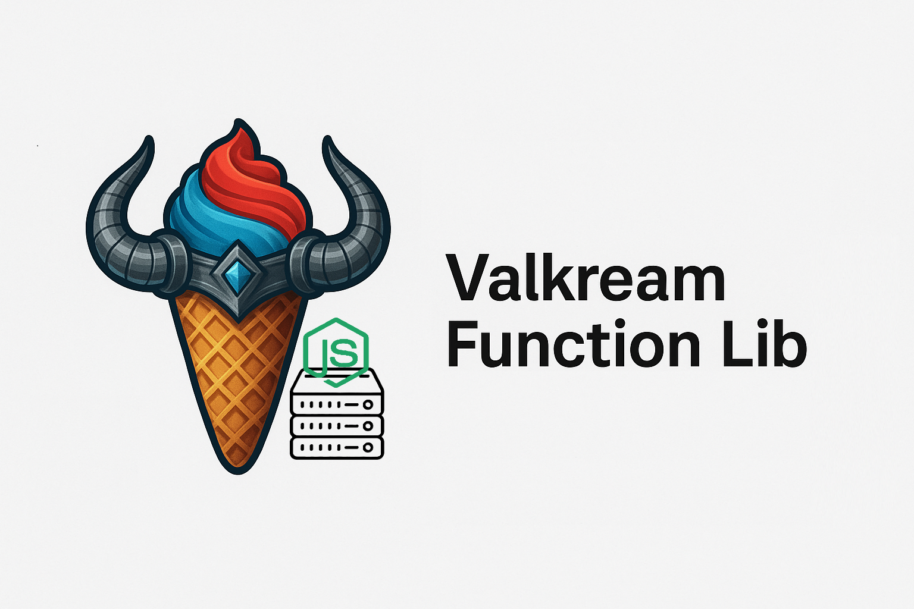

# Valkream Function Lib

Une bibliothèque de fonctions utilitaires pour le développement de gestionnaires de serveur, spécialement conçue pour la gestion de fichiers, la compression/décompression et les interactions console.

## 📦 Installation

```bash
npm install valkream-function-lib
```

## 🚀 Utilisation

```javascript
const {
  cleanGameFolder,
  consoleQuestion,
  consoleStreamAnswer,
  downloadZip,
  formatBytes,
  getAllFilesInAFolder,
  hashFolder,
  sendZip,
  zipFolder,
  unZip,
} = require("valkream-function-lib");
```

## 📚 Fonctions Disponibles

### 🔧 Utilitaires de Formatage

#### `formatBytes(bytes)`

Convertit des bytes en format lisible (B, KB, MB, GB, TB).

```javascript
const { formatBytes } = require("valkream-function-lib");

console.log(formatBytes(1024)); // "1.0 KB"
console.log(formatBytes(1048576)); // "1.0 MB"
```

### 💬 Interactions Console

#### `consoleQuestion(question)`

Pose une question à l'utilisateur via la console et retourne sa réponse.

```javascript
const { consoleQuestion } = require("valkream-function-lib");

const answer = await consoleQuestion("Voulez-vous continuer ? (y/n)");
console.log(`Réponse: ${answer}`);
```

#### `consoleStreamAnswer(message)`

Affiche un message formaté dans la console avec timestamp.

```javascript
const { consoleStreamAnswer } = require("valkream-function-lib");

consoleStreamAnswer("Téléchargement en cours...");
```

### 📁 Gestion de Fichiers

#### `getAllFilesInAFolder(folderPath)`

Récupère tous les fichiers d'un dossier et ses sous-dossiers.

```javascript
const { getAllFilesInAFolder } = require("valkream-function-lib");

const files = getAllFilesInAFolder("./mon-dossier");
console.log(files); // Array de chemins de fichiers
```

#### `hashFolder(folderPath, algorithm)`

Génère un hash SHA-256 de tous les fichiers d'un dossier.

```javascript
const { hashFolder } = require("valkream-function-lib");

const hash = await hashFolder("./mon-dossier", "SHA-256");
console.log(`Hash du dossier: ${hash}`);
```

#### `cleanGameFolder(folderPath)`

Nettoie un dossier de jeu en supprimant les fichiers temporaires.

```javascript
const { cleanGameFolder } = require("valkream-function-lib");

const foldersToClean = [
  /* exemple */ "/folder1/temp",
  "/folder40/subfolder2/cache",
];

await cleanGameFolder("./mon-jeu", foldersToClean);
```

### 📦 Compression et Décompression

#### `zipFolder(sourceFolderPath, zipOutputPath, callback, cancellationToken)`

Compresse un dossier en fichier ZIP avec progression.

```javascript
const { zipFolder } = require("valkream-function-lib");

await zipFolder(
  "./dossier-a-compresser",
  "./archive.zip",
  (processedBytes, totalBytes, fileName, speed) => {
    console.log(`Compression: ${fileName} - ${formatBytes(processedBytes)}`);
  }
);
```

#### `unZip(zipPath, extractPath, callback, cancellationToken)`

Décompresse un fichier ZIP avec progression.

```javascript
const { unZip } = require("valkream-function-lib");

await unZip(
  "./archive.zip",
  "./dossier-destination",
  (processedBytes, totalBytes, fileName, speed) => {
    console.log(`Décompression: ${fileName} - ${formatBytes(processedBytes)}`);
  }
);
```

### 🌐 Téléchargement et Envoi

#### `downloadZip(downloadUrl, destPath, callback)`

Télécharge un fichier ZIP avec barre de progression et limitation de vitesse.

```javascript
const { downloadZip } = require("valkream-function-lib");

await downloadZip(
  "https://example.com/file.zip",
  "./telechargement.zip",
  (downloadedBytes, totalBytes, percent, speed) => {
    console.log(`Téléchargement: ${percent}% - ${formatBytes(speed)}/s`);
  }
);
```

#### `sendZip(zipPath, uploadUrl, callback)`

Envoie un fichier ZIP vers une URL avec progression.

```javascript
const { sendZip } = require("valkream-function-lib");

await sendZip(
  "./archive.zip",
  "https://api.example.com/upload",
  (uploadedBytes, totalBytes, percent, speed) => {
    console.log(`Envoi: ${percent}% - ${formatBytes(speed)}/s`);
  }
);
```

## 🔧 Configuration

### Callbacks de Progression

Toutes les fonctions de compression, décompression, téléchargement et envoi acceptent des callbacks personnalisés :

```javascript
const callback = (processedBytes, totalBytes, fileName, speed) => {
  const percent =
    totalBytes > 0 ? ((processedBytes / totalBytes) * 100).toFixed(1) : 0;
  console.log(`${fileName}: ${percent}% - ${formatBytes(speed)}/s`);
};
```

### Tokens d'Annulation

Les opérations longues peuvent être annulées :

```javascript
const cancellationToken = { cancelled: false };

// Dans une autre partie du code
cancellationToken.cancelled = true;
```

## 📦 Dépendances

- `archiver` - Compression ZIP
- `axios` - Requêtes HTTP
- `extract-zip` - Décompression ZIP
- `form-data` - Envoi de données multipart
- `progress-stream` - Suivi de progression
- `stream-throttle` - Limitation de vitesse
- `unzipper` - Décompression ZIP alternative

## 🤝 Contribution

Les contributions sont les bienvenues ! N'hésitez pas à :

1. Fork le projet
2. Créer une branche pour votre fonctionnalité
3. Commiter vos changements
4. Pousser vers la branche
5. Ouvrir une Pull Request

## 📄 Licence

Ce projet est sous licence MIT.

## 👥 Auteurs

**Valkream Team**

---

_Version: 1.0.6_
